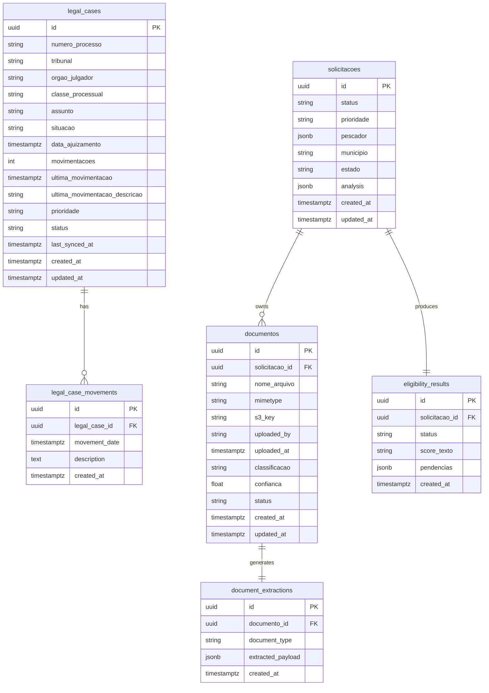

# Diagrams

This document provides architectural diagrams to support the new persistence model and service flows.

## Entity-Relationship Diagram



## Flow & Integration Diagram

```mermaid
flowchart LR
    subgraph Client
        UI[Frontend\n(React/Next)]
    end

    subgraph API["FastAPI Application"]
        direction LR
        SR[Session Router]
        PR[Processos Router]
        SoR[Solicitação Router]
        Cron[Cron Scheduler\n(APScheduler)]
    end

    subgraph UseCases["Domain Use Cases"]
        direction TB
        FindCase[GetLegalCaseById\n/ UpdateStaleLegalCases]
        ProcessDash[BuildProcessDashboard]
        Classify[ClassificarDocumentos]
        Extract[ExtrairDados]
        Eligibility[AvaliarElegibilidade]
        SolicDash[BuildSolicitationDashboard]
    end

    subgraph Infra
        direction TB
        Repos[SQLAlchemy Repositories]
        S3[S3 Client\n(controladoria-backend-docs)]
        Keycloak[Keycloak]
        DataJud[DataJud API]
    end

    Client -->|Cookies access_token| SR -->|AuthenticatedUser| PR
    PR -->|Either result| FindCase
    PR --> ProcessDash
    FindCase -->|Read/Write| Repos
    FindCase -->|Fetch CNJ| DataJud
    ProcessDash --> Repos
    Cron --> FindCase
    Cron --> Repos

    Client --> SoR
    SoR --> Classify --> S3
    Classify --> Repos
    SoR --> Extract --> S3
    Extract --> Repos
    SoR --> Eligibility --> Repos
    SoR --> SolicDash --> Repos

    SR --> Keycloak
```

### Diagram Notes

- **Processos Flow**: `/processos/consultar/{id}` validates the CNJ number, calls `GetLegalCaseByIdUseCase`, persists new cases via repositories, and relies on `FindLegalCaseUseCase` to query DataJud.
- **Cron Job**: The APScheduler job executes `UpdateStaleLegalCasesUseCase` every three days at 00:00 (America/Sao_Paulo), refreshing records whose `last_synced_at` is null or older than three days, persisting only diffs.
- **Solicitação Workflow**: The `/solicitacao` endpoints share repositories. Classification uploads to S3, extraction consumes stored file metadata, and eligibility leverages extracted payloads plus solicitation data.
- **Dashboards**: Both process and solicitation dashboards aggregate using SQLAlchemy functions (e.g., monthly buckets with `date_trunc`) before mapping to DTO responses.

